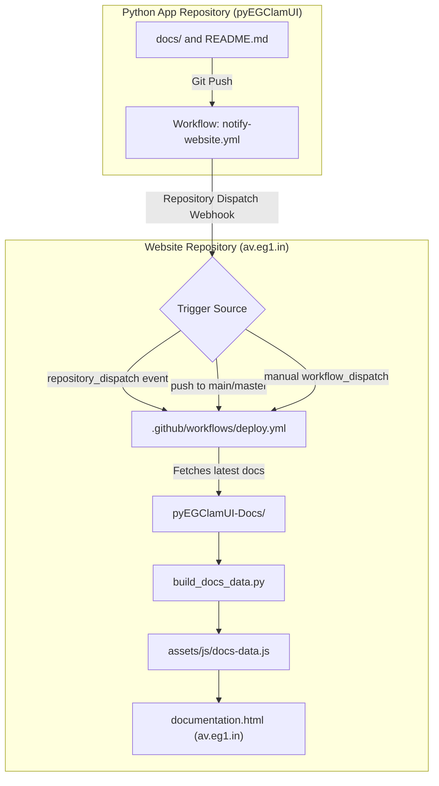

# GitHub Actions Documentation Synchronization Architecture

This document describes how technical documentation is maintained, synchronized, and compiled for the **pyEGClamUI** official web portal ([av.eg1.in](https://av.eg1.in)).

---

## 1. Architectural Overview

The documentation system uses an ahead-of-time (AOT) build compilation strategy. All Markdown files located in [`../pyEGClamUI-Docs/`](../pyEGClamUI-Docs/) are compiled by [`../automation-scripts/build_docs_data.py`](../automation-scripts/build_docs_data.py) into a self-contained, offline-resilient JavaScript bundle: [`../assets/js/docs-data.js`](../assets/js/docs-data.js).

When visitors browse [documentation.html](../documentation.html), the page renders instantaneously (<10ms) without making runtime calls to GitHub API or external CDNs, completely bypassing rate limits.



---

## 2. Website Workflow Details

The website workflow is located at [`.github/workflows/deploy.yml`](../.github/workflows/deploy.yml).

### Trigger Conditions

1. **Direct Commits (`push`)**:
   Automatically triggers on any push to branches `main` or `master`.
2. **Pull Requests (`pull_request`)**:
   Runs verification, doc compilation, and link auditing against incoming PRs.
3. **Manual Execution (`workflow_dispatch`)**:
   Can be triggered manually from the GitHub Actions tab in the website repository. Includes an optional toggle: `fetch_from_app_repo` (defaults to `false`).
4. **Cross-Repo Dispatch (`repository_dispatch`)**:
   Listens for webhook events with type `docs_updated`, `pyegclamui_docs_updated`, or `release_published` sent from the `pyEGClamUI` code repository.

### Workflow Execution Lifecycle

1. **Checkout**: Checks out the website repository.
2. **Python Setup**: Initializes Python 3.11 runner environment.
3. **Remote Sync (Conditional)**:
   If triggered by cross-repo dispatch, attempts a shallow clone of `https://github.com/EG1DOTIN/pyEGClamUI.git`. If docs are found, copies `docs/` and `README.md` into `pyEGClamUI-Docs/`. If the repo is empty or private, it gracefully falls back to the existing local docs without failing.
4. **Site Config & Partial Sync**: Executes `python automation-scripts/sync_site_config.py` to ensure all pages have synchronized versions and partials.
5. **Compilation**: Runs `python automation-scripts/build_docs_data.py` to compile Markdown files into `assets/js/docs-data.js`.
6. **Zero-Broken-Link Audit Gate**: Runs `python automation-scripts/audit_website_links.py` to verify 100% link integrity across all HTML files.
7. **Git Auto-Commit & Push**:
   Checks whether `site-config.json`, `assets/js/docs-data.js`, or HTML pages have changed. If changes exist, commits them with `[skip ci]` to prevent recursive loops and pushes directly to the repository.
8. **GitHub Pages Deployment**: Packages and deploys the audited production build to GitHub Pages.

---

## 3. Connecting the pyEGClamUI App Repository

When you are ready to publish code and documentation to the `EG1DOTIN/pyEGClamUI` repository on GitHub, configure the counterpart workflow in that repository using the steps below.

### Step 1: Create a Personal Access Token (PAT)
To allow the app repository to trigger the website workflow via webhook:
1. In your GitHub account, go to **Settings** > **Developer Settings** > **Personal Access Tokens** > **Fine-grained tokens** (or Classic tokens).
2. Grant `Contents: Read and write` permission (or `repo` scope for classic tokens) targeting the website repository (`av.eg1.in`).
3. In the `pyEGClamUI` repository, go to **Settings** > **Secrets and variables** > **Actions**.
4. Add a new repository secret named `WEBSITE_REPO_TOKEN` containing this token.

### Step 2: Add the Trigger Workflow in `pyEGClamUI`
In the `pyEGClamUI` app repository, create the following workflow file:

**File path in pyEGClamUI**: `.github/workflows/notify-website.yml`

```yaml
name: Notify Website of Docs Update

on:
  push:
    branches:
      - main
      - master
    paths:
      - 'docs/**'
      - 'README.md'
  workflow_dispatch:

jobs:
  dispatch-to-website:
    name: Trigger Website Docs Sync
    runs-on: ubuntu-latest
    steps:
      - name: Dispatch Event to Website Repository
        run: |
          curl -X POST \
            -H "Accept: application/vnd.github.v3+json" \
            -H "Authorization: token ${{ secrets.WEBSITE_REPO_TOKEN }}" \
            https://api.github.com/repos/EG1DOTIN/av.eg1.in/dispatches \
            -d '{"event_type": "docs_updated", "client_payload": {"sender": "pyEGClamUI"}}'
```

*(Note: Replace `EG1DOTIN/av.eg1.in` with your exact GitHub website repository name if different).*

---

## 4. Local Testing & Verification

You can verify the documentation compilation pipeline locally at any time without waiting for GitHub Actions:

### Build Documentation Bundle
Run using Python in your local terminal:
```bash
python automation-scripts/build_docs_data.py
```

Expected output:
```text
Scanning help documents in .../pyEGClamUI-Docs...
Found 16 markdown files.
Successfully generated docs data store: .../assets/js/docs-data.js
  Total documents compiled: 16
  Total link aliases mapped: 106
```

### Audit Website Links
Verify that all 150+ internal links and assets remain 100% valid:
```bash
python automation-scripts/audit_website_links.py
```

Expected output:
```text
Auditing 7 HTML files in ...
Total internal links/assets checked: 156
SUCCESS: All internal links and asset references are valid!
```

---

## 5. Summary of Key Files

| File Path | Description |
| :--- | :--- |
| [`.github/workflows/deploy.yml`](../.github/workflows/deploy.yml) | Website CI/CD GitHub Actions workflow for validating, compiling, auditing, and deploying the portal. |
| [`../automation-scripts/build_docs_data.py`](../automation-scripts/build_docs_data.py) | Python generator script that compiles Markdown documents into JSON store. |
| [`../assets/js/docs-data.js`](../assets/js/docs-data.js) | Compiled JavaScript document data store loaded by the viewer. |
| [`../assets/js/docs-viewer.js`](../assets/js/docs-viewer.js) | Client-side viewer controller handling TOC, navigation, search, and Markdown rendering. |
| [`../pyEGClamUI-Docs/`](../pyEGClamUI-Docs/) | The authoritative source Markdown documents suite (16 technical guides). |
