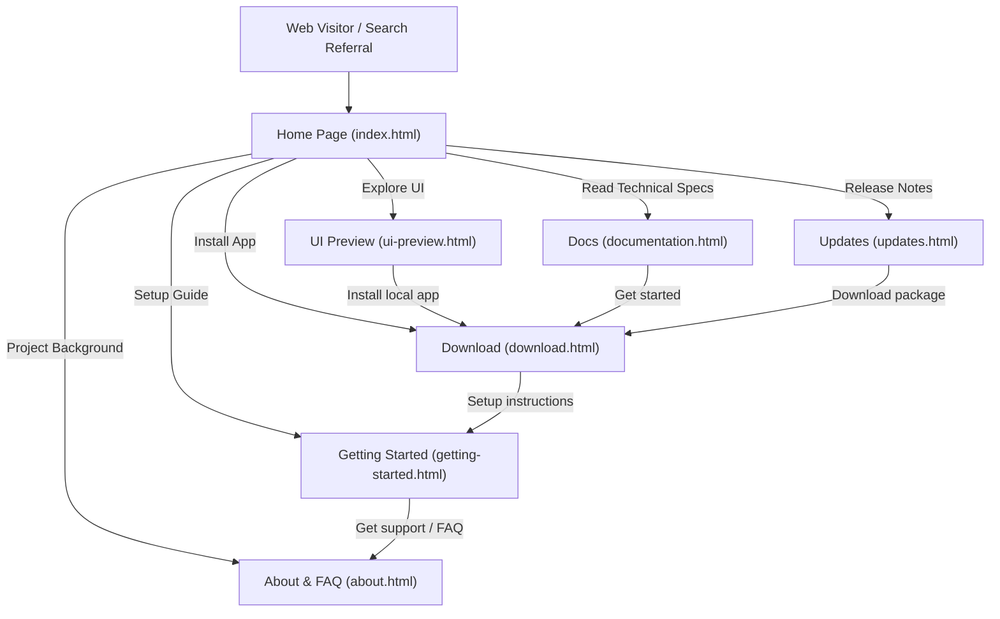

# pyEGClamUI Web Portal Documentation

Welcome to the comprehensive architecture and developer documentation for the official **pyEGClamUI** web portal ([https://av.eg1.in](https://av.eg1.in)).

This directory contains page-wise specifications, design systems, data flow models, and maintenance standards for every page and component on the portal.

---

## 📚 Documentation Index

| Documentation File | Target Page / Area | Core Focus |
| :--- | :--- | :--- |
| [index-page.md](index-page.md) | [index.html](../index.html) | Portal landing page, hero value proposition, security highlights, CTA funnel |
| [documentation-page.md](documentation-page.md) | [documentation.html](../documentation.html) | Technical docs portal, live GitHub Raw sync, session caching, lazy Mermaid, Prism syntax |
| [ui-preview-page.md](ui-preview-page.md) | [ui-preview.html](../ui-preview.html) & [ui-preview.html](ui-preview.html) | Browser-based interactive desktop UI prototype, state matrix, modal simulations |
| [download-page.md](download-page.md) | [download.html](../download.html) | Multi-platform package manager installation, system prerequisites, release badge |
| [getting-started-page.md](getting-started-page.md) | [getting-started.html](../getting-started.html) | Operations manual, first-run wizard, quarantine management, troubleshooting |
| [updates-page.md](updates-page.md) | [updates.html](../updates.html) | Release history, automated GitHub Releases API engine, live platform binaries timeline |
| [how-to-use-page.md](how-to-use-page.md) | [how-to-use.html](../how-to-use.html) | Backward-compatible redirect alias pointing to Getting Started |
| [about-page.md](about-page.md) | [about.html](../about.html) | Open-source philosophy, Cisco ClamAV® trademark attribution, GPL-3.0, FAQ |
| [GITHUB_ACTIONS_DOCS_SYNC.md](GITHUB_ACTIONS_DOCS_SYNC.md) | [.github/workflows/deploy.yml](../.github/workflows/deploy.yml) | Documentation build automation, cross-repo webhook dispatch & CI/CD architecture |

---

## 🗺️ Portal Navigation & User Journey Map



---

## 🧱 Architectural System Structure

The portal is designed around a lightweight, zero-dependency Vanilla architecture ensuring high SEO performance, accessibility (a11y), and rapid client rendering.

```
av.eg1.in/
├── .github/workflows/
│   └── deploy.yml               # CI/CD docs sync, validation, link audit & Pages deploy
├── index.html                   # Landing page & value proposition
├── documentation.html           # Comprehensive technical documentation viewer
├── ui-preview.html              # Interactive desktop UI preview portal
├── download.html                # Platform downloads & package manager instructions
├── getting-started.html         # Step-by-step user walkthrough & guide
├── updates.html                 # Release history, changelogs & direct binaries
├── how-to-use.html              # Backward-compatible redirect to getting-started.html
├── about.html                   # Project overview, FAQ, trademark disclosures
├── site-config.json             # Single source of truth configuration
├── firebase.json                # Firebase Hosting configuration (av.eg1.in)
├── LICENSE                      # GNU General Public License v3.0 (GPL-3.0)
├── THIRD_PARTY_LICENSES.md      # Vendored third-party library notices & licenses
├── partials/                    # Modular reusable page components
│   ├── header.html              # Global navigation bar & brand header
│   └── footer.html              # Global legal notice, disclaimer & links
├── assets/
│   ├── css/
│   │   ├── style.css            # Primary portal stylesheet & tokens
│   │   ├── tokens.css           # Design tokens & color system
│   │   ├── docs.css             # Technical documentation layout stylesheet
│   │   └── desktop-preview.css  # Emulated native desktop window stylesheet
│   ├── js/
│   │   ├── main.js              # Client-side dynamic config injector & toggles
│   │   ├── visitor-tracker.js   # Opt-in batched visitor analytics tracker
│   │   ├── desktop-preview.js   # Interactive desktop mockup simulation engine
│   │   ├── docs-data.js         # Compiled offline documentation data store (18 guides)
│   │   └── docs-viewer.js       # Markdown docs controller (live GitHub sync & lazy Mermaid)
│   ├── data/
│   │   └── updates.json         # Legacy offline schema (live releases synced via GitHub API)
│   ├── vendor/                  # Offline runtime libraries (marked, prism, mermaid)
│   └── images/                  # Production brand logos, icons, and SEO cards
├── docs/                        # Architecture & page specifications (9 developer guides)
├── pyEGClamUI-Docs/             # Upstream application technical documentation suite (18 guides)
├── automation-scripts/          # Maintenance, audit, and build tools
│   ├── sync_site_config.py      # Synchronize version metadata from site-config.json
│   ├── sync_components.py       # Synchronize header/footer partials across pages
│   ├── sync_docs_from_github.py # Pull latest documentation suite from GitHub main branch
│   ├── build_docs_data.py       # Compile pyEGClamUI-Docs into assets/js/docs-data.js
│   ├── download_vendor_assets.py # Vendor offline runtime libraries
│   └── audit_website_links.py   # Zero-broken-link audit gate (100% verified)
└── gitignore/                   # Local media assets & maintenance scripts (gitignored)
    ├── media/                   # High-res screenshots, animated GIFs & videos
    └── python-scripts/          # Local media generation and maintenance scripts
```

---

## ⚙️ Global Configuration Model & Automated Runtime Sync

The website combines an offline baseline with a **dynamic runtime GitHub synchronization layer**:

1. **Offline Baseline (`site-config.json`)**: Contains baseline project metadata, repository links, and contact endpoints for offline resilience, initial HTML rendering, and SEO crawlers.
2. **Dynamic Runtime GitHub Sync (`assets/js/main.js`)**: When visitors load any page on the portal, `main.js` queries `https://api.github.com/repos/EG1DOTIN/pyEGClamUI/releases` (cached for 15 minutes). The latest release tag, publication date, download assets, and changelog are dynamically resolved and automatically injected into all `[data-config="version"]`, `[data-config="releaseDate"]`, and `[data-gh-download]` elements across the entire website.
3. **Dynamic Documentation Sync (`assets/js/docs-viewer.js`)**: When visitors browse [documentation.html](../documentation.html), the viewer dynamically fetches the latest live Markdown files directly from `raw.githubusercontent.com/EG1DOTIN/pyEGClamUI/main/`.

Whenever a new version or document update is pushed to GitHub, the live website automatically reflects the new version and content without requiring manual code changes.

```json
{
  "project": {
    "name": "pyEGClamUI",
    "version": "<dynamic_from_github_releases>",
    "releaseStage": "Beta Release",
    "tagline": "An Open-Source, Cross-Platform Desktop GUI for ClamAV",
    "license": "GNU GPL-3.0"
  },
  "github": {
    "repo": "https://github.com/EG1DOTIN/pyEGClamUI",
    "issues": "https://github.com/EG1DOTIN/pyEGClamUI/issues",
    "releases": "https://github.com/EG1DOTIN/pyEGClamUI/releases"
  }
}
```

---

## 🎨 Global Design System Tokens

The color scheme is configured via CSS Custom Properties in [assets/css/style.css](../assets/css/style.css), adhering to the dark cybersecurity theme:

| Token Name | Value | Purpose |
| :--- | :--- | :--- |
| `--accent-sky` | `#38bdf8` | Primary interactive highlights, active tabs, buttons |
| `--accent-green` | `#00dc82` / `#22c55e` | Success states, protected shields, active badges |
| `--accent-amber` | `#eab308` | Warning state matrix, caution notifications |
| `--accent-red` | `#ef4444` | Threat detection alerts, engine offline warnings |
| `--bg-dark` | `#0c0d0e` | Portal background canvas |
| `--bg-card` | `#121417` | Card and container elevation background |
| `--border-color` | `#23272f` | Subtle container and component borders |
