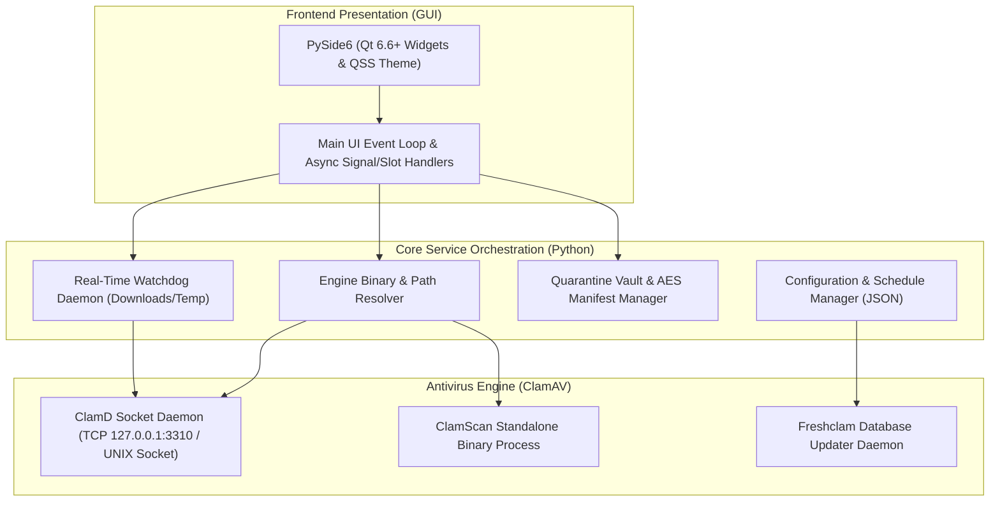

# About & FAQ Page Documentation (`about.html`)

Source File: [about.html](../about.html)  
Live URL: [https://av.eg1.in/about.html](https://av.eg1.in/about.html)

---

## 📌 Page Overview & Objectives

The About & FAQ page establishes the legal, technical, and open-source foundation of **pyEGClamUI**. It provides developers and users with full transparency regarding project ownership, GNU GPL-3.0 licensing terms, mandatory Cisco ClamAV® trademark notices, and architectural answers to frequently asked questions.

---

## ⚖️ Legal, Licensing & Trademark Compliance

### 1. Trademark Disclaimer
In strict adherence to brand guidelines, the following trademark notice is permanently housed on every page across the portal and within the application's About dialog:

> **Trademark Notice**: ClamAV® is a registered trademark of Cisco Systems, Inc. pyEGClamUI is an independent open-source frontend developed by EG1 and is not affiliated with, endorsed by, or sponsored by Cisco Systems, Inc.

### 2. GNU General Public License v3.0 (GPL-3.0)
- **Freedom to Inspect**: Full source code is public and auditable on [GitHub](https://github.com/EG1DOTIN/pyEGClamUI).
- **Freedom to Distribute**: Users can redistribute copies and modifications under identical GPL-3.0 terms.
- **No Warranty**: Software is provided "as is", without warranty of any kind.

---

## 🏗️ Technology Stack Hierarchy

---

## ❓ Frequently Asked Questions (FAQ)

| Question | Answer & Architectural Reality |
| :--- | :--- |
| **Is pyEGClamUI completely free?** | Yes. It is 100% free and open-source under the GNU General Public License v3.0 (GPL-3.0). There are no paywalls, subscriptions, or locked features. |
| **Does pyEGClamUI upload my files to the cloud?** | No. All scanning is performed locally on your machine using the installed ClamAV® engine. Files never leave your local system. |
| **Can I run pyEGClamUI alongside Windows Defender?** | Yes. pyEGClamUI focuses real-time protection on user-selected high-risk folders (`Downloads` and `Temp`) to avoid conflicting with primary system antivirus solutions. |
| **What platforms are supported?** | Windows 10/11, major Linux distributions (Ubuntu, Debian, Fedora, Arch), and macOS (Apple Silicon and Intel). |
| **How are false positives handled?** | You can inspect quarantined files inside the Quarantine Vault tab and restore them to their exact original location with one click. |
| **How do I report bugs or submit feature requests?** | Open an issue on our official [GitHub Issues Tracker](https://github.com/EG1DOTIN/pyEGClamUI/issues). |

---

## 🔗 Related Components & Assets

- **Source HTML**: [about.html](../about.html)
- **Master Header**: [partials/header.html](../partials/header.html)
- **Master Footer**: [partials/footer.html](../partials/footer.html)
- **Stylesheet**: [assets/css/style.css](../assets/css/style.css)
- **About Dialog Screenshot**: [gitignore/media/pyegclamui-about-dialog.png](../gitignore/media/pyegclamui-about-dialog.png)
