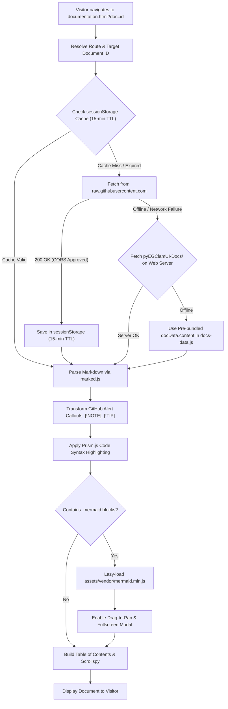

# Documentation Portal Page Specification (`documentation.html`)

Source File: [documentation.html](../documentation.html)  
Client Controller: [assets/js/docs-viewer.js](../assets/js/docs-viewer.js)  
Offline Data Store: [assets/js/docs-data.js](../assets/js/docs-data.js)  
Live Source: GitHub Repository (`https://raw.githubusercontent.com/EG1DOTIN/pyEGClamUI/main/`)  
Live URL: [https://av.eg1.in/documentation.html](https://av.eg1.in/documentation.html)

---

## 📌 Page Overview & Objectives

The Documentation Portal is the technical knowledge hub for **pyEGClamUI**. It renders an exhaustive suite of 18 technical guides—spanning system architecture, core concurrency models, real-time filesystem guard internals, scanner streaming, quarantine isolation, telemetry transparency, and release engineering.

The portal is designed for maximum speed, accessibility (WCAG AA), responsive fluid navigation, and zero-maintenance synchronicity with the upstream GitHub codebase.

---

## 🔄 Dynamic Content Architecture & Live GitHub Sync

---

## 📑 Core Features & Subsystems

### 1. Hybrid Live/Offline Data Architecture
- **Instant GitHub Pipeline Sync**: Whenever changes are pushed to `main` in `EG1DOTIN/pyEGClamUI`, the browser's dynamic fetch engine automatically pulls the live markdown directly from GitHub Raw (`Access-Control-Allow-Origin: *`).
- **Snappy 15-Minute Session Caching**: Prevents redundant network requests while browsing between tabs and sections.
- **4-Tier Resilient Fallback Chain**:
  1. *Tier 1*: Live GitHub Raw markdown
  2. *Tier 2*: Cached session entry
  3. *Tier 3*: Local web server copy (`pyEGClamUI-Docs/...`)
  4. *Tier 4*: Pre-bundled offline JavaScript dataset ([assets/js/docs-data.js](../assets/js/docs-data.js))

### 2. Markdown Parsing & Custom Renderers
- **Slugs & Anchor Links**: Automatically creates URL-safe slug IDs on all `<h2>` and `<h3>` headings with permalink anchors (`#`).
- **Cross-Document Linking**: Relative repository links (e.g. `[Architecture](docs/ARCHITECTURE.md)`) are intercepted and converted into seamless single-page document transitions via `DOCS_DATA.linkMap`.
- **Source Code Links**: Relative repository paths (e.g. `src/pyegclamui/...`) automatically link directly to the corresponding file on GitHub `main`.
- **Alert Callouts**: Transforms standard GitHub blockquote callouts (`[!NOTE]`, `[!TIP]`, `[!IMPORTANT]`, `[!WARNING]`, `[!CAUTION]`) into styled, accessible callout boxes with dedicated SVGs.

### 3. High-Performance Diagram Engine (Lazy-Loaded Mermaid)
- **On-Demand Loading**: `mermaid.min.js` (~3.3MB uncompressed) is loaded dynamically **only** when a document contains architectural diagrams. This reduces initial page load size by over 80%.
- **Interactive Drag-to-Pan**: Diagram viewports can be clicked and dragged horizontally for effortless navigation on both desktop and mobile touchscreens.
- **Fullscreen Modal**: Each diagram features an expand button and double-click handler that opens a responsive modal view.

### 4. Navigation & Table of Contents (TOC)
- **Left Navigation Drawer**: Categorized accordion-style document groups (`Getting Started`, `Core Architecture`, `Subsystem Deep Dives`, `Reference & Hardening`) with real-time title search filtering.
- **Right On-Page TOC**: Automatically generated list of `<h2>` and `<h3>` headings with `IntersectionObserver` scrollspy tracking active reading position.
- **URL Routing & History**: Full browser back/forward support with deep linking via query parameter (`?doc=<id>`) and anchor hash (`#<slug>`).

---

## 🔗 Related Components & Assets

- **Source HTML**: [documentation.html](../documentation.html)
- **Viewer Engine**: [assets/js/docs-viewer.js](../assets/js/docs-viewer.js)
- **Bundled Data Store**: [assets/js/docs-data.js](../assets/js/docs-data.js)
- **Stylesheet**: [assets/css/docs.css](../assets/css/docs.css)
- **Compiler Script**: [automation-scripts/build_docs_data.py](../automation-scripts/build_docs_data.py)
- **Sync Tool**: [automation-scripts/sync_docs_from_github.py](../automation-scripts/sync_docs_from_github.py)
- **Header & Footer**: [partials/header.html](../partials/header.html), [partials/footer.html](../partials/footer.html)
