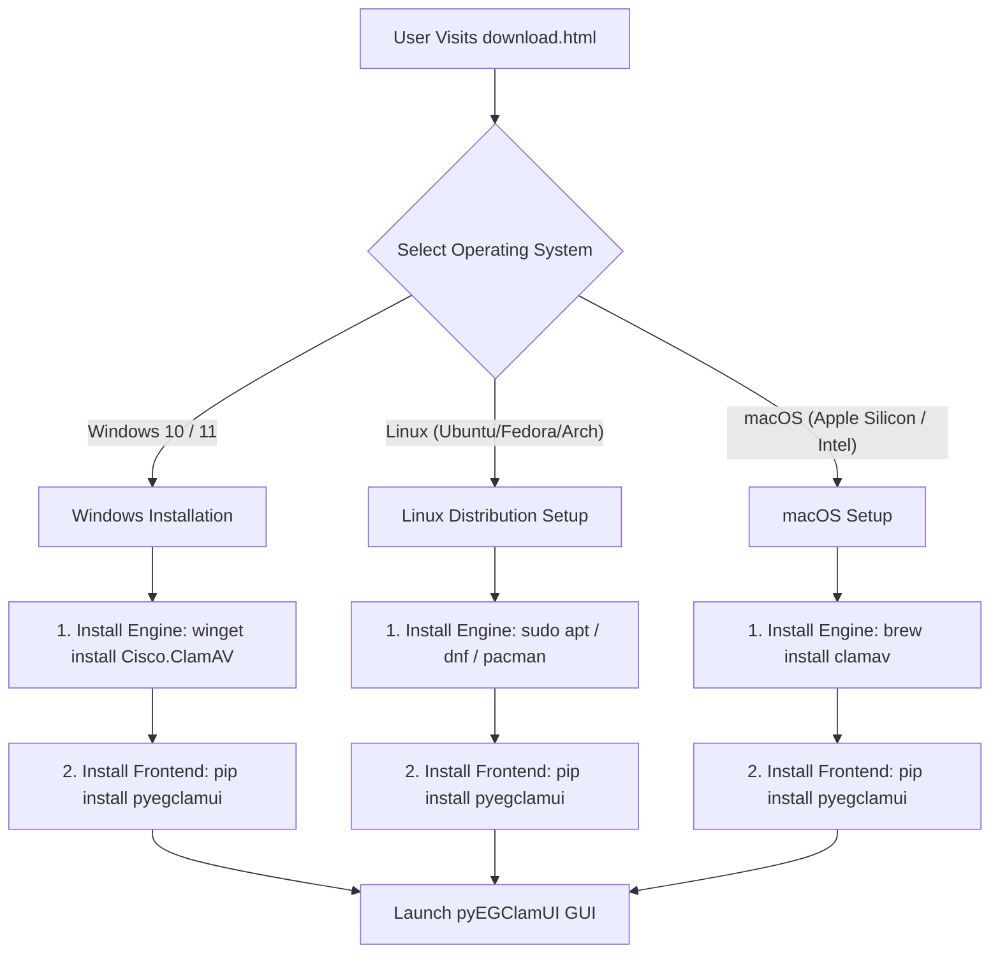

# Download Page Documentation (`download.html`)

Source File: [download.html](../download.html)  
Live URL: [https://av.eg1.in/download.html](https://av.eg1.in/download.html)

---

## 📌 Page Overview & Release Stage Constraint

The Download page guides users through acquiring and setting up **pyEGClamUI** across supported desktop operating systems. Because pyEGClamUI is a frontend that orchestrates the underlying ClamAV® daemon, the page clearly outlines both the engine prerequisites and frontend package installation commands.

> [!IMPORTANT]
> **Single Source of Truth & Beta Placement Constraint**:
> - The baseline release version and stage are initialized from [site-config.json](../site-config.json) and dynamically kept in sync with the latest published GitHub release at runtime by `assets/js/main.js`.
> - As mandated by project rules, the **"Beta Release"** badge is displayed **only on this page**, adjacent to the primary download banner. It must never appear on the homepage, navigation bar, footer, or other pages.

---

## 📦 Multi-Platform Installation Flow

---

## 💾 Standalone Desktop Binaries (Direct Downloads)

Standalone single-click packages with bundled assets and dependencies are continuously published via automated GitHub Actions CI/CD workflows and automatically mapped in real-time on this page using the GitHub Releases API engine in [assets/js/main.js](../assets/js/main.js):

| Platform | Package File | Format | Direct Download Link |
| :--- | :--- | :--- | :--- |
| **Windows 10/11 (Installer)** | `pyegclamui-setup-x64.exe` | Standalone Inno Setup Installer | [Download Installer (.exe)](https://github.com/EG1DOTIN/pyEGClamUI/releases/latest/download/pyegclamui-setup-x64.exe) |
| **Windows 10/11 (Portable)** | `pyegclamui-windows-x64.zip` | Standalone Portable ZIP Archive | [Download Portable (.zip)](https://github.com/EG1DOTIN/pyEGClamUI/releases/latest/download/pyegclamui-windows-x64.zip) |
| **Linux (x86_64)** | `pyegclamui-linux-x86_64.tar.gz` | Standalone Gzip Tarball | [Download Linux (.tar.gz)](https://github.com/EG1DOTIN/pyEGClamUI/releases/latest/download/pyegclamui-linux-x86_64.tar.gz) |
| **macOS (Universal)** | `pyegclamui-macos.zip` | Standalone ZIP Archive | [Download macOS (.zip)](https://github.com/EG1DOTIN/pyEGClamUI/releases/latest/download/pyegclamui-macos.zip) |
| **Security Checksum** | `SHA256SUMS.txt` | Cryptographic SHA-256 Hashes | [Download SHA256SUMS.txt](https://github.com/EG1DOTIN/pyEGClamUI/releases/latest/download/SHA256SUMS.txt) |

### Automated Client-Side Binding
Download cards and buttons on [download.html](../download.html) utilize `data-gh-download` hooks (`win_installer`, `win_portable`, `linux`, `mac`, `sha256`). On page load, `main.js` automatically binds the live release URLs, asset filenames, and formatted file sizes directly from the GitHub Releases API.

---

## 💻 Platform Installation Commands

All command instructions are kept synchronized with [site-config.json](../site-config.json):

| Platform | Package Manager | Engine Setup Command | Frontend Install Command |
| :--- | :--- | :--- | :--- |
| **Windows 10 / 11** | Winget / Pip | `winget install Cisco.ClamAV` | `pip install pyegclamui` |
| **Ubuntu / Debian** | APT / Pip | `sudo apt update && sudo apt install -y clamav clamav-daemon` | `pip install pyegclamui` |
| **Fedora / RHEL** | DNF / Pip | `sudo dnf install -y clamav clamd clamav-update` | `pip install pyegclamui` |
| **Arch Linux** | Pacman / Pip | `sudo pacman -S clamav` | `pip install pyegclamui` |
| **macOS** | Homebrew / Pip | `brew install clamav` | `pip install pyegclamui` |

---

## 📋 System Prerequisites Checklist

Before launching pyEGClamUI, systems must satisfy these baseline requirements:

| Requirement | Minimum Supported Version | Purpose |
| :--- | :--- | :--- |
| **Python Runtime** | Python 3.10 or later | Execution environment for the PySide6 application |
| **ClamAV Engine** | ClamAV 1.0.0 or later | Antivirus inspection binaries (`clamscan`, `freshclam`, `clamd`) |
| **GUI Framework** | PySide6 (Qt 6.6+) | Native desktop windowing, widgets, and themes |
| **RAM** | 512 MB available | ClamAV database signature indexing and buffer |
| **Disk Space** | ~500 MB | Virus signature database (`daily.cvd`, `main.cvd`, `bytecode.cvd`) |

---

## 🔗 Related Components & Assets

- **Source HTML**: [download.html](../download.html)
- **Configuration Master**: [site-config.json](../site-config.json)
- **Sync Script**: [automation-scripts/sync_site_config.py](../automation-scripts/sync_site_config.py)
- **Header & Footer**: [partials/header.html](../partials/header.html), [partials/footer.html](../partials/footer.html)
