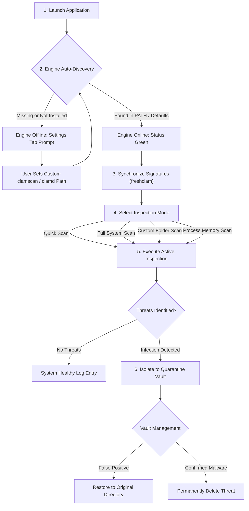

# Getting Started Page Documentation (`getting-started.html`)

Source File: [getting-started.html](../getting-started.html)  
Live URL: [https://av.eg1.in/getting-started.html](https://av.eg1.in/getting-started.html)

---

## 📌 Page Overview & Objectives

The Getting Started page serves as the official operational guide and tutorial walkthrough for **pyEGClamUI**. It walks new users through the initial engine handshake, updating virus definition databases, initiating scans, managing quarantined files, and configuring Real-Time Folder Guard.

---

## 🔄 Application Operational Lifecycle

---

## 📖 Step-by-Step Operational Workflow

### Step 1: First-Run Engine Detection
Upon launch, pyEGClamUI automatically scans system environment paths for ClamAV binaries:
- **Windows**: `C:\Program Files\ClamAV\clamscan.exe`, `C:\Program Files (x86)\ClamAV\...`, or `%PATH%`.
- **Linux**: `/usr/bin/clamscan`, `/usr/local/bin/clamscan`.
- **macOS**: `/opt/homebrew/bin/clamscan` or `/usr/local/bin/clamscan`.

### Step 2: Virus Definition Synchronization
1. Navigate to the **Status** tab.
2. Click **Check for Updates**.
3. The engine connects to official ClamAV mirrors via `freshclam` and downloads updated definitions.
4. Once completed, the database badge displays `Fresh` with current signature counts.

### Step 3: Running Scans
1. Switch to the **Scan** tab.
2. Select your desired mode (**Quick Scan**, **Full System Scan**, **Custom Scan**, or **Memory Scan**).
3. The UI streams detection stdout in real time with line-by-line file inspections.

### Step 4: Real-Time Folder Guard
1. Switch to the **Settings** tab.
2. Enable **Real-Time Protection**.
3. By default, it guards the user's `Downloads` and `Desktop` directories against newly dropped threats using kernel filesystem events (`watchdog`).

---

## 🛡️ Quarantine Isolation & Privacy Protections

- **Neutralization**: Inbound threats are sanitized, assigned non-executable `.quarantine` extensions, and locked down with restricted filesystem permissions (`0o700`).
- **Cryptographic Hashing**: Every quarantined file receives pre- and post-isolation SHA-256 validation logged in a companion metadata manifest.
- **Privacy Masking**: User path identifiers and usernames are automatically masked when generating crash diagnostics and bug reports.
