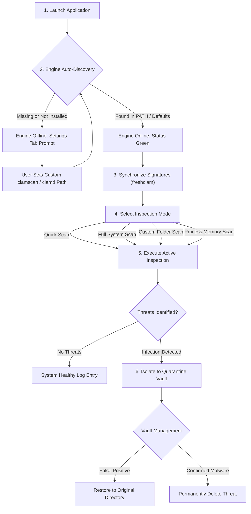

# How to Use Page Documentation (`how-to-use.html`)

Source File: [how-to-use.html](../how-to-use.html)  
Live URL: [https://av.eg1.in/how-to-use.html](https://av.eg1.in/how-to-use.html)

---

## 📌 Page Overview & Objectives

The How-to-Use page (`how-to-use.html`) serves as a backward-compatible redirect and legacy alias pointing to the comprehensive [Getting Started Guide](../getting-started.html) (`getting-started.html`). It ensures any incoming bookmarks, external links, or legacy references seamlessly route users to the latest onboarding and operations guide.

> [!NOTE]
> **Permanent Redirect**: `how-to-use.html` incorporates both an HTTP-equiv meta refresh and a client-side `window.location.replace("getting-started.html")` redirect to ensure instant routing without broken links. The primary user manual is maintained at [getting-started-page.md](getting-started-page.md).

---

## 🔄 Application Operational Lifecycle

---

## 📖 Step-by-Step Operational Workflow

### Step 1: First-Run Engine Detection
Upon launch, pyEGClamUI automatically scans system environment paths for ClamAV binaries:
- **Windows**: `C:\Program Files\ClamAV\clamscan.exe`, `C:\Program Files (x86)\ClamAV\...`, or `%PATH%`.
- **Linux**: `/usr/bin/clamscan`, `/usr/local/bin/clamscan`.
- **macOS**: `/opt/homebrew/bin/clamscan` or `/usr/local/bin/clamscan`.

### Step 2: Virus Definition Synchronization
1. Navigate to the **Status** tab.
2. Click **Check for Updates**.
3. The engine connects to official ClamAV mirrors via `freshclam` and downloads updated definitions.
4. Once completed, the database badge displays `Fresh` with current signature counts.

### Step 3: Running Scans
1. Switch to the **Scan** tab.
2. Select your desired mode (**Quick Scan**, **Full System Scan**, **Custom Scan**, or **Memory Scan**).
3. The active inspection modal opens, displaying live telemetry: scanned file count, elapsed time, and real-time threat detections.
4. Click **Stop Scan** at any time if necessary.

### Step 4: Quarantine Vault & Threat Remediation
1. Detected files are automatically isolated into the **Quarantine Vault**.
2. Select any infected entry in the table to view detection time, threat tag, and original path.
3. Click **Restore** if the file is a known false positive, or **Delete** / **Purge** to permanently remove it.

---

## 🛠️ Common Troubleshooting Scenarios

| Issue Symptom | Root Cause | Solution |
| :--- | :--- | :--- |
| **"Engine Not Detected" (Red Shield)** | ClamAV binaries are not in system PATH or default installation folder | Open the **Settings** tab and manually browse to `clamscan.exe` and `freshclam.exe` |
| **Database Update Failed** | Firewall blocking port 80/443 or mirror rate-limiting | Verify internet connectivity; check `freshclam.conf` settings in ClamAV directory |
| **Scan Fails on System Files** | Insufficient user permissions to read restricted OS folders | Run pyEGClamUI with elevated administrator / root privileges |
| **Real-Time Guard Idle** | Watched directories (`Downloads` / `Temp`) do not exist or lack read rights | Verify path existence in settings; ensure user permissions permit filesystem event monitoring |

---

## 🔗 Related Components & Assets

- **Source HTML**: [how-to-use.html](../how-to-use.html)
- **Header Navigation**: [partials/header.html](../partials/header.html)
- **Footer Attribution**: [partials/footer.html](../partials/footer.html)
- **Stylesheet**: [assets/css/style.css](../assets/css/style.css)
- **Screenshots**: [gitignore/media/pyegclamui-active-scan-dialog.png](../gitignore/media/pyegclamui-active-scan-dialog.png), [gitignore/media/pyegclamui-settings-config.png](../gitignore/media/pyegclamui-settings-config.png)
