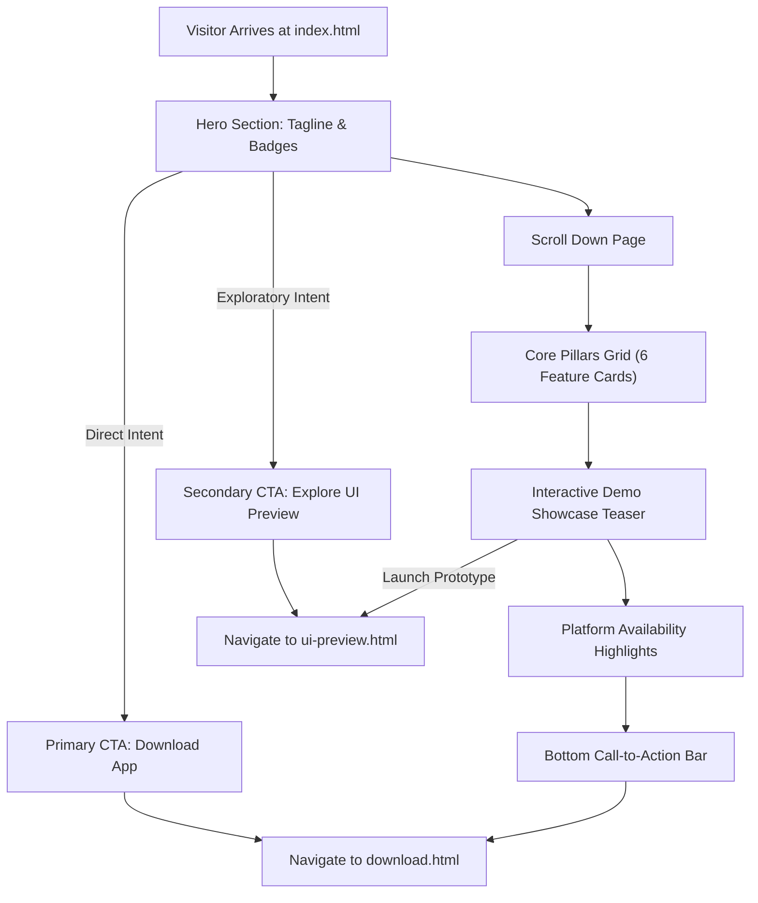

# Homepage Documentation (`index.html`)

Source File: [index.html](../index.html)  
Live URL: [https://av.eg1.in/](https://av.eg1.in/)

---

## 📌 Page Overview & Objectives

The homepage acts as the primary conversion funnel and informational gateway for **pyEGClamUI**. It establishes immediate credibility through a dark cybersecurity aesthetic, highlights the core benefits of a modern desktop GUI for the ClamAV® engine, and drives users toward either direct download or interactive exploration.

### Core Objectives
1. **Communicate Value in 5 Seconds**: Immediately convey that pyEGClamUI modernizes ClamAV with a native desktop GUI and real-time defense.
2. **Drive Key Actions**: Dual call-to-action (CTA) directs high-intent users to [download.html](../download.html) and curious visitors to [ui-preview.html](../ui-preview.html).
3. **SEO Authority**: Optimized meta tags, OpenGraph previews ([assets/images/og-preview.png](../assets/images/og-preview.png)), structured JSON-LD schema, and keyword targeting for desktop ClamAV interfaces.
4. **Compliance Constraint**: Adhere strictly to the project rule: Never mention "Beta Release" or "Testing" on the homepage.

---

## 🧭 User Conversion & Action Flow

---

## 📑 Section-by-Section Architecture

| Section ID | Title / Purpose | Core Content | Primary Interactions |
| :--- | :--- | :--- | :--- |
| `hero` | Main Value Proposition | Brand icon, punchy headline, summary description, platform badges | "Download Now" & "Try Live Demo →" buttons |
| `pillars` | 6 Core Architectural Pillars | Smart 2-Folder Guard, Multi-Engine Scans, Quarantine Vault, Freshclam Sync, Privacy, Open Source | Hover cards with subtle elevation transitions |
| `interactive-teaser` | Desktop UI Preview Teaser | Visual representation of emulated desktop app and feature callouts | "Launch Full Interactive Prototype →" |
| `tech-specs` | Performance & Resource Highlights | Lightweight RAM usage, cross-platform PySide6 stack, native ClamAV compatibility | Comparative metric indicators |
| `cta-banner` | Final Call-to-Action | Reinforces GPL-3.0 licensing and direct GitHub repository links | Links to [download.html](../download.html) |

---

## 📊 Core Feature Matrix

| Feature Highlight | Technical Description | User Benefit |
| :--- | :--- | :--- |
| **Smart 2-Folder Guard** | Monitors high-risk directories (`Downloads` and `Temp`) via file-system hooks | Minimal CPU/RAM overhead compared to full-disk real-time monitors |
| **4 Scan Modes** | Quick Scan, Full System Scan, Custom Folder Scan, and Active Memory Scan | Flexible threat detection matching user time constraints |
| **Quarantine Isolation** | Neutralizes file headers and stores threats in restricted quarantine vault | Prevents accidental execution while allowing false-positive restore |
| **Automated Updates** | Native integration with `freshclam` daemon and mirrors | Daily virus signature synchronization without manual CLI intervention |
| **Zero-Tracking Privacy** | Opt-in diagnostic crash reporting only with transparent local logs | Complete user data sovereignty |

---

## 🔗 Related Components & Assets

- **Header Template**: [partials/header.html](../partials/header.html)
- **Footer Template**: [partials/footer.html](../partials/footer.html)
- **Styling**: [assets/css/style.css](../assets/css/style.css)
- **Client Script**: [assets/js/main.js](../assets/js/main.js)
- **OpenGraph Asset**: [assets/images/og-preview.png](../assets/images/og-preview.png)
- **Branding Icon**: [assets/images/egav.svg](../assets/images/egav.svg)
