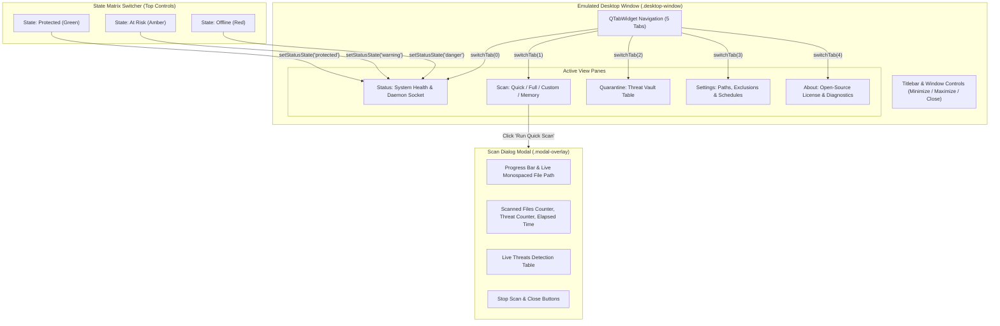

# UI Preview & Interactive Prototype Documentation (`ui-preview.html`)

Source Files:  
- Portal Page: [ui-preview.html](../ui-preview.html)  
- Standalone Prototype: [docs/ui-preview.html](ui-preview.html)  
- Desktop Preview CSS: [assets/css/desktop-preview.css](../assets/css/desktop-preview.css)  
Live URL: [https://av.eg1.in/ui-preview.html](https://av.eg1.in/ui-preview.html)

---

## 📌 Page Overview & Scope Constraint

The UI Preview page provides a fully functional, zero-install interactive mockup of the **pyEGClamUI** desktop interface right inside modern web browsers. It allows prospective users to experience the application's look, feel, responsive behavior, and workflow before installing the application locally.

> [!NOTE]
> **Project Scope Constraint**: In accordance with pyEGClamUI architecture standards, the live interactive desktop preview is hosted strictly on [ui-preview.html](../ui-preview.html). The homepage ([index.html](../index.html)) provides a teaser link to this page but does not embed the window directly.

---

## 🎛️ Prototype State Architecture

---

## 📑 Emulated Tabs & Interactive Controls

| Tab Name | Internal ID | Interactive Elements | Visual / Functional Behavior |
| :--- | :--- | :--- | :--- |
| **Status** | `pane-status` | "Check for Updates" button, State switcher | Updates shield icon color, stroke path, status text, and engine badge |
| **Scan** | `pane-scan` | 4 Scan mode buttons | Launches modal scan simulation with real-time file rolling animations |
| **Quarantine** | `pane-quarantine` | Quarantine file table rows, action buttons | Clicking table rows toggles `.selected` class; enables action controls |
| **Settings** | `pane-settings` | File path inputs, telemetry toggles, schedule inputs | Toggle switches disable/enable sub-widgets smoothly |
| **About** | `pane-about` | Log folder button, Diagnostics button, Links | Displays GPL-3.0 attribution and Cisco ClamAV® trademark disclaimer |

---

## 🖥️ Active Scan Modal Simulation

The prototype includes an emulated `ScanDialog` (`#scanModal`) replicating the native PySide6 dialog:

1. **Titlebar Header**: Displays active scan type (e.g. *Quick Scan*, *Full System Scan*).
2. **Current File Tracker**: Monospaced ticker cycling through system libraries and directories.
3. **Indeterminate / Determinate Progress Bar**: Fluid CSS animation simulating active ClamAV file inspection.
4. **Live Telemetry Row**: Counters for scanned files, detected threats, and elapsed scan seconds.
5. **Detection Table**: Displays quarantined items (`Eicar-Test-Signature`), timestamp, and quarantined path.
6. **Dismissal Controls**: Stop button, Close button, and `Escape` key shortcut.

---

## 🔗 Related Components & Assets

- **Portal Page**: [ui-preview.html](../ui-preview.html)
- **Standalone Prototype**: [docs/ui-preview.html](ui-preview.html)
- **Desktop Window CSS**: [assets/css/desktop-preview.css](../assets/css/desktop-preview.css)
- **Screenshot Asset**: [gitignore/media/pyegclamui-active-scan-dialog.png](../gitignore/media/pyegclamui-active-scan-dialog.png)
- **Animated Walkthrough**: [gitignore/media/pyegclamui-app-tour.gif](../gitignore/media/pyegclamui-app-tour.gif)
