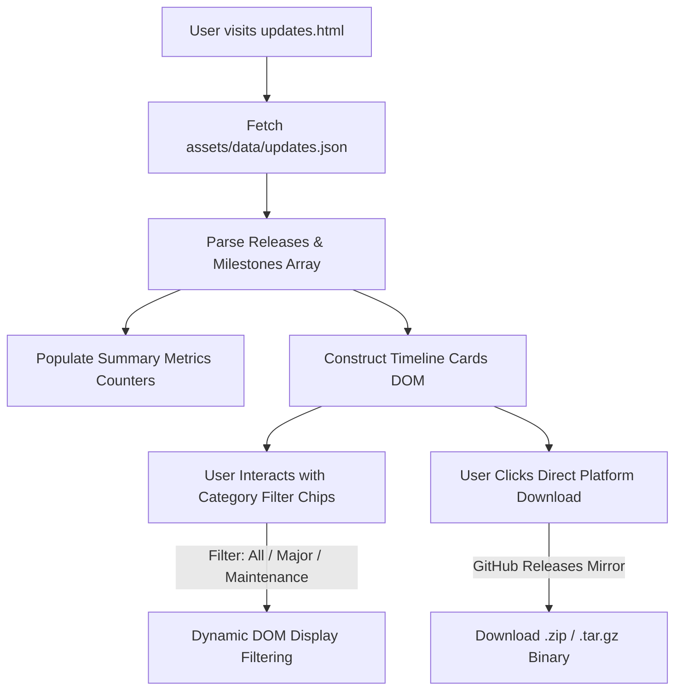

# Updates & Release History Page Documentation (`updates.html`)

Source File: [updates.html](../updates.html)  
Data Store: [assets/data/updates.json](../assets/data/updates.json)  
Live URL: [https://av.eg1.in/updates.html](https://av.eg1.in/updates.html)

---

## 📌 Page Overview & Objectives

The Updates page provides a comprehensive chronological timeline of all releases, version milestones, security advisories, and feature updates for **pyEGClamUI**. It enables users to browse release notes, verify checksums, and directly download standalone binary packages for Windows, Linux, and macOS.

---

## 🔄 Release Data & Rendering Architecture

---

## 📑 Core Features & Components

### 1. Release Timeline Cards
- **Version Badges**: Color-coded badges distinguishing major milestones from maintenance/bugfix releases.
- **Release Metadata**: Release date, SemVer identifier, and release summary description.
- **Categorized Highlights**: Bulleted change categories (New Features, Enhancements, Bug Fixes, Security).
- **Direct Download Actions**: Direct download buttons for Windows (`.zip`), Linux (`.tar.gz`), and macOS (`.zip`).

### 2. Live Category Filtering
- Interactive chip filters allowing users to filter releases by tag (`All`, `Stable`, `Beta`, `Hotfix`).
- Instantaneous client-side filtering with zero page reload.

### 3. Decoupled Data Source (`updates.json`)
- All release entries, dates, highlights, and binary package URLs are maintained in [`assets/data/updates.json`](../assets/data/updates.json).
- The presentation layer dynamically maps this JSON schema into accessible semantic HTML markup.

---

## 🔗 Related Components & Assets

- **Source HTML**: [updates.html](../updates.html)
- **Data Store**: [assets/data/updates.json](../assets/data/updates.json)
- **Header Navigation**: [partials/header.html](../partials/header.html)
- **Footer Attribution**: [partials/footer.html](../partials/footer.html)
- **Primary Stylesheet**: [assets/css/style.css](../assets/css/style.css)
