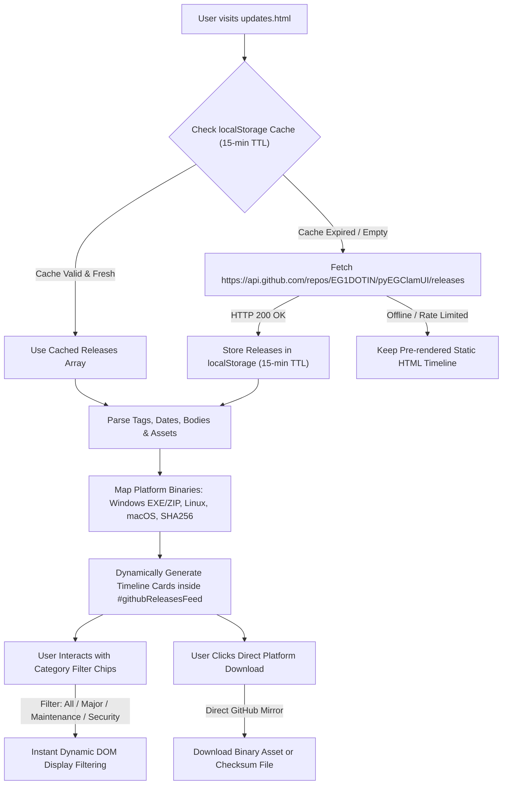

# Updates & Release History Page Documentation (`updates.html`)

Source File: [updates.html](../updates.html)  
Data Provider: Live GitHub Releases API (`https://api.github.com/repos/EG1DOTIN/pyEGClamUI/releases`)  
Client Controller: [assets/js/main.js](../assets/js/main.js)  
Live URL: [https://av.eg1.in/updates.html](https://av.eg1.in/updates.html)

---

## 📌 Page Overview & Objectives

The Updates page provides a comprehensive, chronological timeline of all releases, version milestones, security advisories, and feature updates for **pyEGClamUI**. It enables users to browse release notes, verify checksums, and directly download standalone binary packages for Windows, Linux, and macOS.

The page is powered by a **100% automated GitHub Releases API sync engine** implemented in [assets/js/main.js](../assets/js/main.js), eliminating the need for manual file edits or static JSON maintenance whenever a new release is published on GitHub.

---

## 🔄 Release Data & Automated GitHub Sync Architecture

---

## 📑 Core Features & Components

### 1. Automated GitHub Releases Sync Engine
- **Live Repository Query**: On page load, `main.js` queries `https://api.github.com/repos/EG1DOTIN/pyEGClamUI/releases`.
- **Smart 15-Minute TTL Caching**: Results are stored in `localStorage` under key `pyeg_gh_releases` with a 15-minute expiration timestamp to ensure instant page loads and prevent GitHub API rate limiting.
- **Dynamic Platform Binary Mapping**: Automatically scans each release's `assets` array to discover:
  - **Windows Installer**: `.exe` packages (built with Inno Setup)
  - **Windows Portable**: `.zip` archives
  - **Linux Standalone**: `.tar.gz` packages
  - **macOS Universal**: `.zip` / `.dmg` archives
  - **Cryptographic Hash**: `SHA256SUMS.txt`
- **Markdown Body Parsing**: Automatically converts GitHub release markdown changelogs into accessible HTML lists and headings.

### 2. Dual-Layer Fallback Architecture
- **Offline / Crawler Resilient**: The HTML source of [updates.html](../updates.html) contains pre-rendered semantic baseline markup to serve as a fallback for offline visitors or search engine bots, while online visitors immediately receive the live releases array directly from the GitHub API.
- If GitHub API is unreachable, offline, or rate-limited, visitors and search engine bots still view the release timeline without empty states or layout shifts.
- **Decommissioned `updates.json`**: Previously, releases relied on manual entry in `assets/data/updates.json`. This manual workflow is now completely decommissioned and replaced by the automated GitHub API integration.

### 3. Live Category Filtering
- Interactive chip filters allowing users to filter releases by tag (`All`, `Major Releases`, `Maintenance`, `Security`).
- Instantaneous client-side filtering with zero page reload.

### 4. Direct Platform Download Actions
- Direct, authenticated GitHub download links for all published platform packages.
- SHA-256 checksum download button enabling cryptographic package verification.

---

## 🔗 Related Components & Assets

- **Source HTML**: [updates.html](../updates.html)
- **Client Script**: [assets/js/main.js](../assets/js/main.js)
- **Header Navigation**: [partials/header.html](../partials/header.html)
- **Footer Attribution**: [partials/footer.html](../partials/footer.html)
- **Primary Stylesheet**: [assets/css/style.css](../assets/css/style.css)
